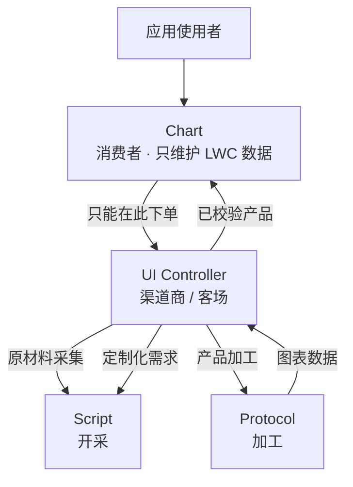
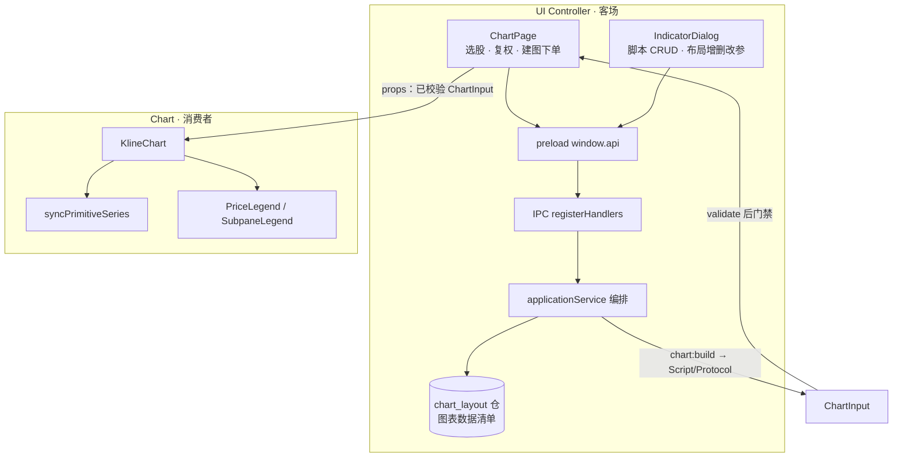
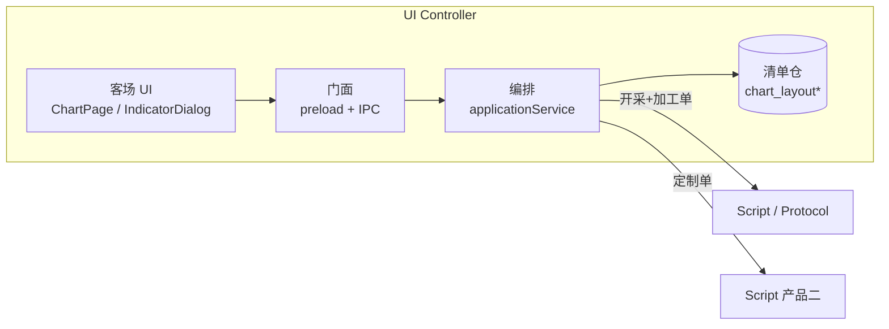
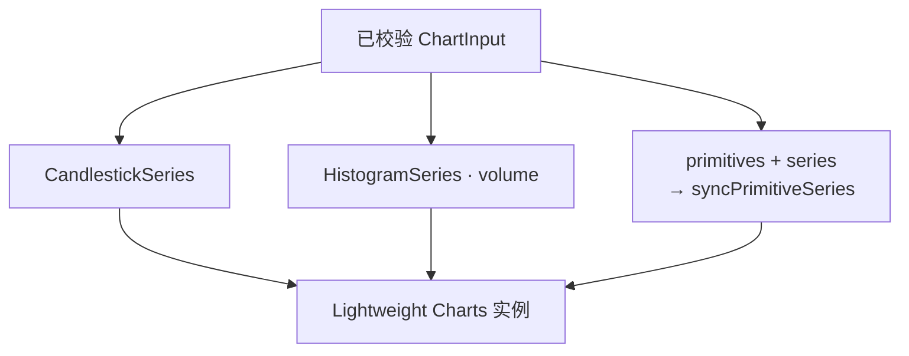
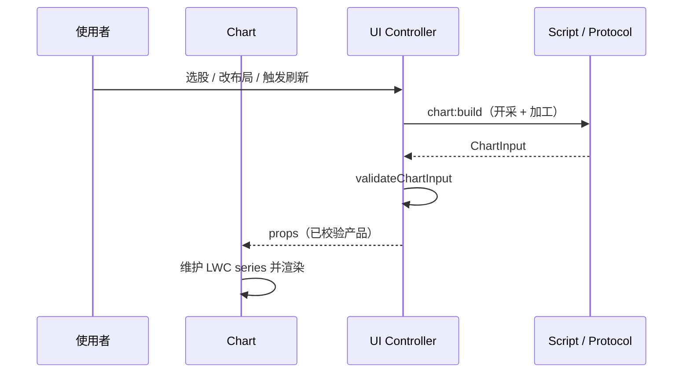
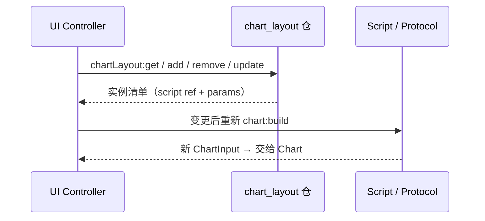
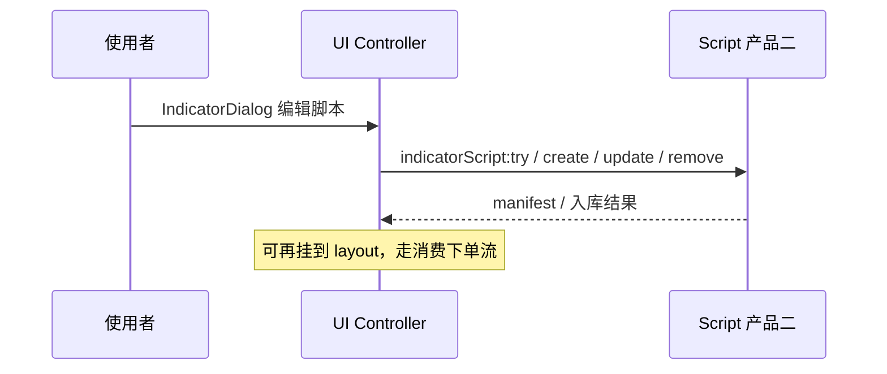

# UI Controller + Chart 系统架构

> 基于 v0.2 产品模型「商流链」——二者合并展示：  
> - **UI Controller** = 渠道商 / 客场  
> - **Chart** = 终端消费者  
> **边界提醒：** 消费者（Chart）只能在客场下单；不关心开采与中间加工。客场替消费者向 Script / Protocol 下单，并替用户提交定制化需求。

---

## 1. 商流链中的位置

| 角色 | 关系 |
|------|------|
| Chart → UI Controller | **唯一下单通道**；Chart 不直连 Script / Protocol |
| UI → Script / Protocol | 代下「开采」与「加工」单；另代下「定制脚本」单 |
| UI 知悉产出 | 知道市面上能买到的「图表数据」清单（布局实例 + 脚本元数据） |
| 补充 | 所有数据遵循时间序列 |

---

## 2. 合并边界：客场 + 消费者

二者紧耦合展示，但职责分离：

| | UI Controller（渠道） | Chart（消费者） |
|--|----------------------|-----------------|
| 职责 | 下单、编排、清单 CRUD、定制入口 | 渲染 Lightweight Charts |
| 是否调 IPC | 是（`window.api.*`） | **否** |
| 持有数据 | 选股参数、layout、scripts、原始/校验后 ChartInput | LWC series refs（candle/volume/primitives） |
| 仓库 | `chart_layout` / items（图表数据清单） | 无持久仓 |

---

## 3. UI Controller 内部结构

渠道内分三块：

1. **客场 UI** — 消费场所与定制入口  
2. **门面 / 编排** — IPC + applicationService  
3. **清单仓** — 布局实例（非算法仓；算法仓属 Script）  

### 设计要点（产品文档原文）

- 为消费者提供消费场所；**只能在此下单**  
- 消费者不必考虑初期处理与中间传输  
- 知道 Script + Protocol 最终产出，提供可买的「图表数据」清单  
- 替消费者向 Script 下「创建定制化需求」  

---

## 4. Chart 内部结构

消费者内分三块：

1. **输入** — 只收已校验的 `ChartInput`（+ 图例用 layout/scripts 元数据）  
2. **一等序列** — candle / volume  
3. **Primitives** — overlay / subplot → Line / Histogram  

### 设计要点（产品文档原文）

- 终端消费者，服务于应用使用者  
- **只维护** Lightweight Charts 需要的数据  
- **只向** UI Controller 下单获取这些数据  

### 渲染映射

| ChartInput | Lightweight Charts |
|------------|-------------------|
| `candle[]` | `CandlestickSeries` |
| `volume[]` | `HistogramSeries`（主图副轴） |
| `primitives` + `series[id]` | Line / Histogram（按 pane 分主/副图） |
| `time`（YYYY-MM-DD） | LWC `Time` |

---

## 5. 主流程

### 5.1 消费下单（获取图表数据）

### 5.2 清单维护（图表数据「货架」）

### 5.3 代下定制单

---

## 6. 产品概念 ↔ 落点

### UI Controller

| 产品概念 | 落点 |
|----------|------|
| 渠道商 / 客场 | `ChartPage` + `IndicatorDialog` + `applicationService` |
| 图表数据清单 | `chart_layout` / `chart_layout_item`（`ChartLayout.items`） |
| 替 Chart 下单 | `chart:build` → Script 开采 + Protocol 形态产出 |
| 替用户定制 | `indicatorScript:*` |
| 知悉产出形态 | 持有 `ChartInput` state；图例用 layout/scripts 元数据 |

### Chart

| 产品概念 | 落点 |
|----------|------|
| 终端消费者 | `KlineChart` |
| 只维护 LWC 数据 | candle / volume / primitiveSeries Map |
| 只向 UI 下单 | 无 `window.api`；订单全在 `ChartPage` |
| 图表数据产品 | 校验后的 `ChartInput` props |

### 边界暧昧点（写清即可）

- `validateChartInput` 跑在 `ChartPage`：渠道入口门禁，产品上也可视为 Protocol 双端校验的前端一侧  
- 图例依赖 `layout` / `scripts`：属展示元数据，经 UI props 注入，Chart **仍不直连** Script  

---

## 7. 接口一览（客场对外门面）

**面向 Chart / 使用者（Renderer）**

| 通道 | 角色 |
|------|------|
| `chart:build` | 向 Script/Protocol 下开采+加工单 |
| `chartLayout:get \| add \| remove \| update` | 清单 CRUD |
| `indicatorScript:*` | 代下定制开采单 |
| `market:coverage` / `stocks:list` 等 | 客场辅助（选股/区间） |

**面向 Chart（组件边界）**

- 入参：已校验 `ChartInput`；可选 layout/scripts（图例）  
- 出：无 IPC；仅 UI 交互（crosshair、pane、resize）  
